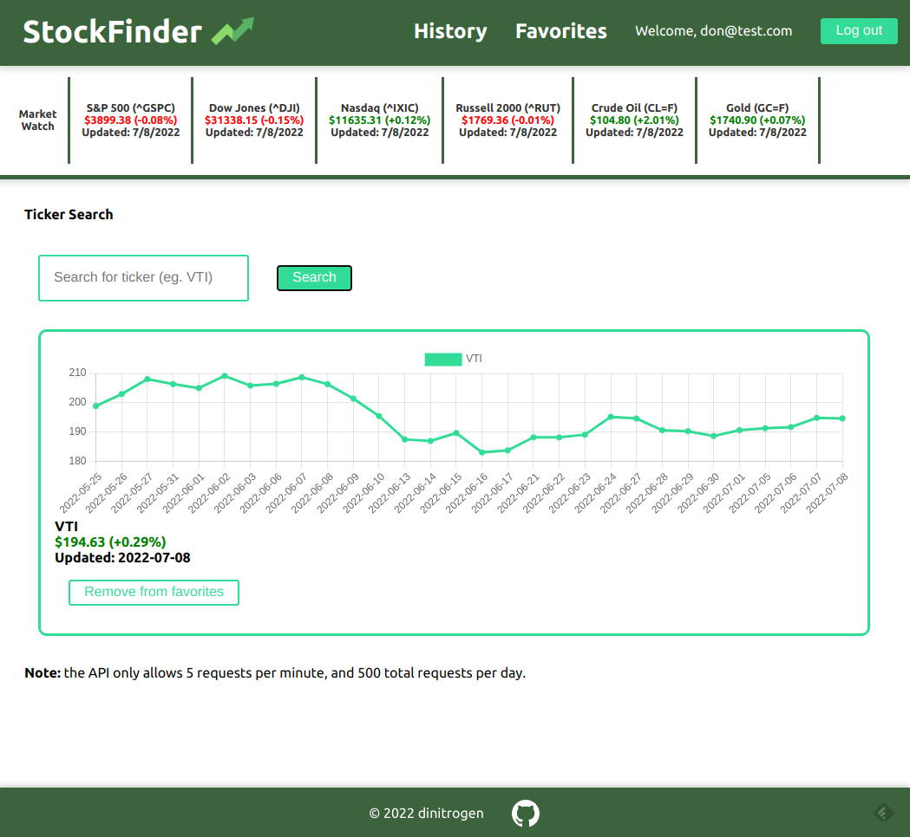
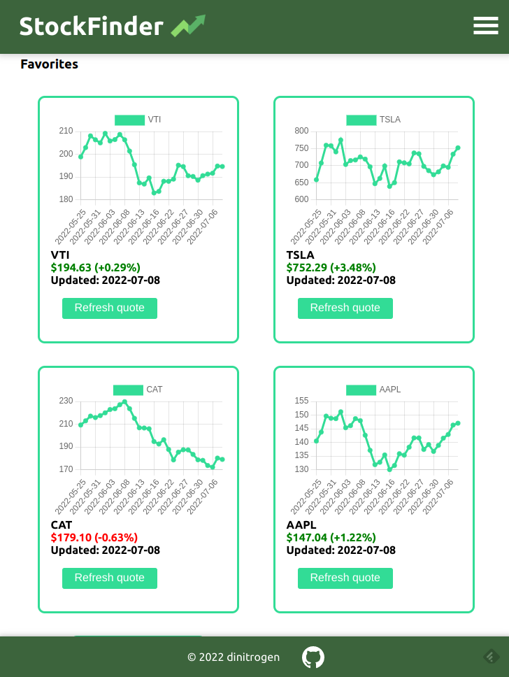
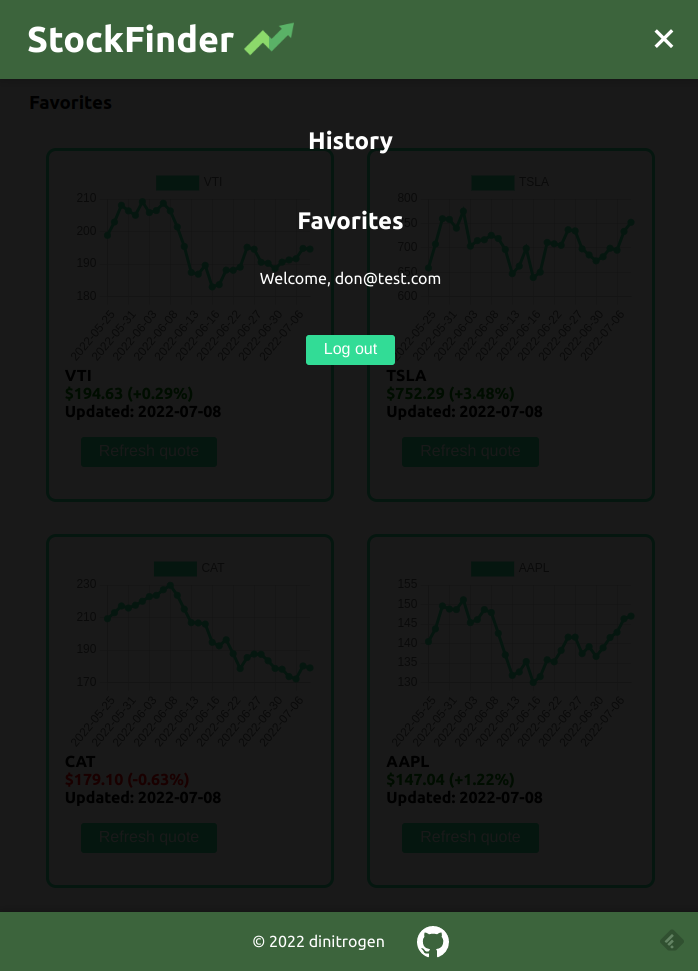

# Stock Finder

## Description

A finance web app for searching and tracking stock market quotes, created with React and Firebase. Users can create an account and log in with email/password to access and track stocks, and save favorites to their account, and review the current session search history. The app is compatible and responsive to both desktop and mobile use.

## Live Demo

- ### [Live Demo](https://finance-react-app-63c8b.web.app/)

## Screenshots

## Planned updates
- Improve visual appeal with a global theme
- Add customizable date range for charts (eg. 5d, 30d, 60d)

## Tools used
- [React](https://reactjs.org/)
- [Google Firebase](https://firebase.google.com/)
- [Styled Components](https://styled-components.com/)
- [Alpha Vantage Stock API](https://www.alphavantage.co/)
- [ChartJS](https://www.chartjs.org/) & [react-chartjs-2](https://react-chartjs-2.js.org/)

 